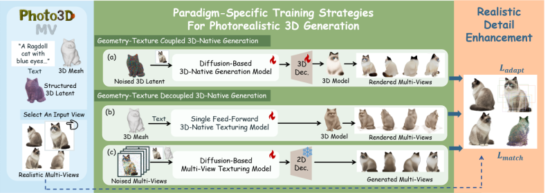

<div align="center">
<h2>Photo3D: Advancing Photorealistic 3D Generation through Structure‑Aligned Detail Enhancement</h2>

[Xinyue Liang](https://scholar.google.com/citations?user=R9PlnKgAAAAJ&hl=zh-CN) |
[Zhiyuan Ma](https://scholar.google.com/citations?user=F15mLDYAAAAJ&hl=en)| 
[Lingchen Sun](https://scholar.google.com/citations?hl=zh-CN&tzom=-480&user=ZCDjTn8AAAAJ) | 
Yanjun Guo | 
[Lei Zhang](https://www4.comp.polyu.edu.hk/~cslzhang)

<br>

The Hong Kong Polytechnic University  

<br>


<h3>CVPR 2026</h3>

</div>

<div>
    <h4 align="center">
     <a href="https://liangsanzhu.github.io/photo3d-page/" target='_blank'>
        
        </a>
        <a href="https://arxiv.org/pdf/2512.08535" target='_blank'>
        
        </a>
         <a href="https://github.com/Liangsanzhu/Photo3D/" target='_blank'>
        
        </a>
        <a href="https://huggingface.co/datasets/LaPetitRose/Photo3D-MV" target='_blank'>
        
        </a>
    </h4>
</div>


## 🎬 Demo Video (Click the image to watch on YouTube)

<p align="center">
  <a href="https://www.youtube.com/watch?v=lvOJoPdczvA" target="_blank">
    
  </a>
</p>


## 📰 News
- **[2026.03]** We released **Photo3D-MV**, a large-scale multi-view dataset for photorealistic 3D generation! Download it at [Hugging Face](https://huggingface.co/datasets/LaPetitRose/Photo3D-MV).
- **[2026.03]** TexGaussian-based Photo3D training/inference guide is available in [`TexGaussian/README.md`](TexGaussian/README.md).
- **[2026.03]** TRELLIS-based Photo3D inference is now available in [`TRELLIS/`](TRELLIS), with ready-to-run download and inference commands in [`TRELLIS/README.md`](TRELLIS/README.md).


## 🌟 Overview Framework

<p align="center">



</p>


## 🔧 Dependencies and Installation

1. Clone repo
    ```bash
    git clone https://github.com/Liangsanzhu/Photo3D.git
    cd Photo3D
    ```

2. Use Photo3D TRELLIS

   - Install TRELLIS environment first by following the official TRELLIS repo: [microsoft/TRELLIS](https://github.com/microsoft/TRELLIS).
   - Download checkpoints to `TRELLIS/ckpt/`:
     ```bash
     cd Photo3D/TRELLIS
     mkdir -p ckpt
     
     huggingface-cli download LaPetitRose/Photo3D_models \
       --repo-type model \
       --include "Trellis/*" \
       --local-dir .
     
     cp -r Trellis/* ckpt/
     rm -rf Trellis
     ```
   - Run inference directly:
     ```bash
     cd Photo3D/TRELLIS
     
     python infer.py \
       --input ./assets/42.png \
       --output-dir ./output \
       --pretrained microsoft/TRELLIS-image-large \
       --slat-flow-ckpt ./ckpt/slat_denoiser.pt \
       --slat-flow-json ./ckpt/config.json \
       --decoder-ckpt ./ckpt/decoder.safetensors
     ```

## 📦 Dataset Notes (Photo3D-MV)

- Dataset URL: [LaPetitRose/Photo3D-MV](https://huggingface.co/datasets/LaPetitRose/Photo3D-MV)
- Some samples may have image size/orientation mismatches with 3D models due to limitations of the 2D generator used during data construction.
- As recent 2D generators preserve structure better, re-optimizing `rgb_grid.png` (e.g., "keep geometry unchanged, make texture more realistic") can further improve results.
    
## 💬 Contact:
If you have any problem, please feel free to contact me at xinyue.liang@connect.polyu.hk

### Citations
If our code helps your research or work, please consider citing our paper.
The following are BibTeX references:

```
@misc{liang2026photo3dadvancingphotorealistic3d,
      title={Photo3D: Advancing Photorealistic 3D Generation through Structure-Aligned Detail Enhancement}, 
      author={Xinyue Liang and Zhinyuan Ma and Lingchen Sun and Yanjun Guo and Lei Zhang},
      year={2026},
      eprint={2512.08535},
      archivePrefix={arXiv},
      primaryClass={cs.CV},
      url={https://arxiv.org/abs/2512.08535}, 
}
